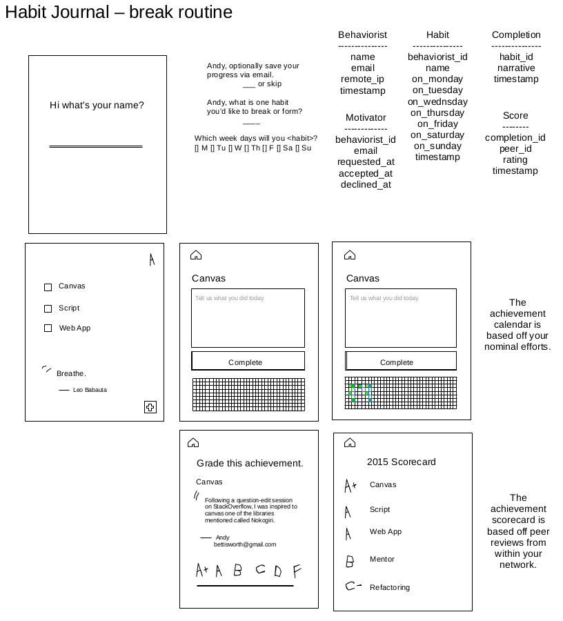
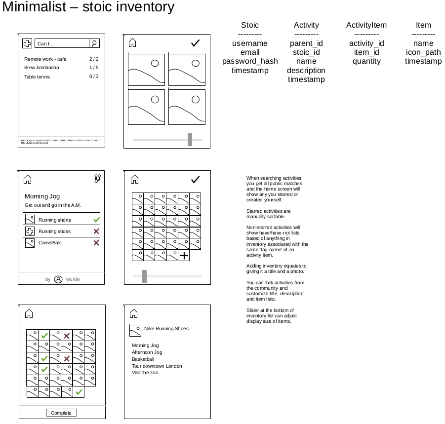
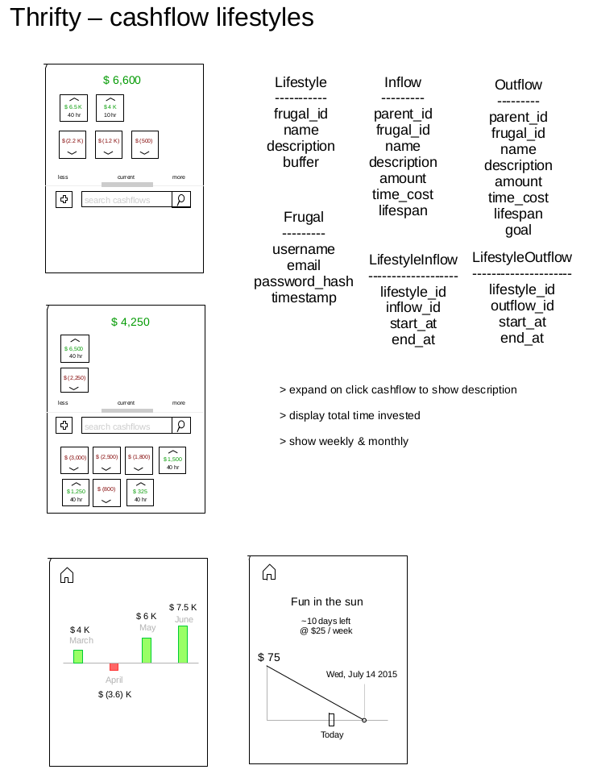

# Drawings

## What are drawings and why do I need them?

**The drawings conceptualize what your application's schema and interface looks like.** Getting to real screens and real data is important for effective communicatation between you, your team, and potential customers. Customers at this phase will be able to playtest on paper. Playing with real screens will raise usability issues and spark new feature requests. This early problem solving will lower development costs proportionally to the number of variations explored. Copy and paste is your friend here; select a screen, copy it over, edit it, and repeat. In contrast, making the same change in code often requires adding a new URL route, connecting that route to a new controller method, which renders out a new HTML template, has new CSS style, and additional JavaScript added behavior.

Drawings inlcude one PDF and one ODG document created alongside our README inside our project. GitHub supports rendering PDF documents in browser making internet access all that's required to viewing recent changes. The ODG is where all the changes are made and PDF is rendered from. The editing software is the free LibreDraw application from the LibreOffice suite available on Windows, Mac, and Linux operating systems.

D> ## Collaborate with the customer
D>
D> Bring your most valued users into this phase for a boost of creativity.

## Example 1 

## Example 2 

## Example 3

